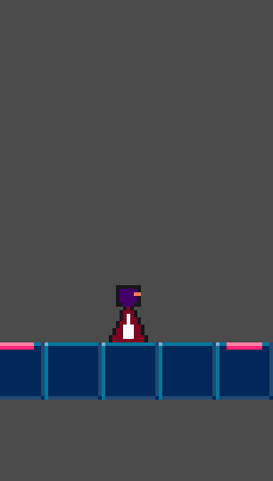

# Neon Dash Trail

---

## Vision

**Neon Dash Trail** is a small 2D runner developed with Godot and C#. Instead of a traditional endless mode, it features 
handcrafted levels. The goal of the project is to learn and demonstrate the fundamentals of game development with Godot.

The game combines fast, precise controls with a neon aesthetic and offers a series of pre-designed levels, each featuring 
its own challenges and design ideas.

This project also serves as a devlog to make the development process transparent and provide insights into creating a 
small but complete game.

### Namenskonventionen

- Entity
  - Eine größere zusammenhängende Szene, welche sich aktiv im Spiel befindet (bspw. Runner)
- Manager
  - Verwaltet Zustände vom Spiel (bspw. MenuManager) 
- [Connectors (Erklärung)](docs/pattern/ConnectorPattern.md)
  - System zum einfachen Verbinden von Signalen über mehrere Komponentenebenen hinweg  

---

## Devlog

Willkommen zum Entwicklungstagebuch von **Neon Dash Trail**! Hier dokumentiere ich regelmäßig Fortschritte, Herausforderungen und spannende Erkenntnisse.

### Version 0.4 – Der Dash (2025-07-07)

- State machine zur einfacheren Erweiterung von Runner-States implementiert
- Runner kann jetzt auf Tastendruck dashen

### Version 0.3 – Erste Levelstrukturen (2025-07-06)

- Checkpoints zu denen der Runner bewegt werden kann
- Checkpoints werden automatisch vom Runner beim Vorbeilaufen aktiviert
- Der Runner kann per Tastendruck oder bei einer Kollision in ein Hindernis, zu einem Checkpoint zurückgesetzt werden
- Beim Erreichen des Ziels wird das Hauptmenü angezeigt
- Beim Betreten des JumpingPads wird ein höherer Sprung ausgeführt

### Version 0.2 – Menüs (2025-07-03)

- Haupt- und Pausenmenü implementiert
- Spieler können während des Spiels pausieren
- Kommunikation mithilfe Connectors zwischen entlegenen Nodes

### Version 0.1 – Start (2025-07-02)

- Projekt initialisiert mit Godot 4.4
- Erste Spielfigur und Bewegung implementiert
- Einfaches Level mit Grundmechaniken (Laufen, Springen, Hindernisse) angelegt

---

Vielen Dank fürs Lesen – Jonas 👋🏻

## Assets & Quellen

### Soundeffekte

👉🏻 [Detaillierte Auflistung](docs/sources/audio_sources.md)

- Diverse Soundeffekte von [Kenney.nl](https://kenney.nl/) (Public Domain, CC0)
