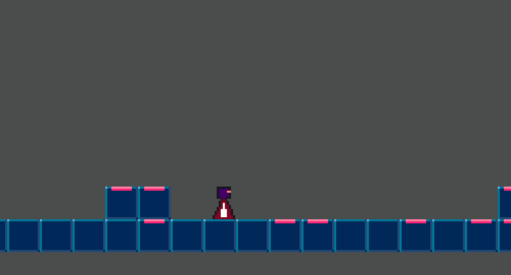

# Neon Dash Trail

---

## Vision

**Neon Dash Trail** ist ein kleiner 2D-Runner, entwickelt mit Godot und C#, der handgebaute Level statt eines klassischen Endlosmodus bietet. Ziel des Projekts ist es, die Grundlagen von Game Development mit Godot zu erlernen und zu demonstrieren.

Das Spiel kombiniert schnelle, präzise Steuerung in Neon-Look und bietet eine Reihe von vorgefertigten Leveln, die jeweils eigene Herausforderungen und Designideen enthalten.

Dieses Projekt dient außerdem als Devlog, um den Entwicklungsprozess transparent zu machen und Einblicke in die Entwicklung eines kleinen, aber vollständigen Spiels zu geben.

### Namenskonventionen

- Entity
  - Eine größere zusammenhängende Szene, welche sich aktiv im Spiel befindet (bspw. Runner)
- Manager
  - Verwaltet Zustände vom Spiel (bspw. MenuManager) 
- [Connectors (Erklärung)](docs/pattern/ConnectorPattern.md)
  - System zum einfachen Verbinden von Signalen über mehrere Komponentenebenen hinweg  

---

## Devlog

Willkommen zum Entwicklungstagebuch von **Neon Dash Trail**! Hier dokumentiere ich regelmäßig Fortschritte, Herausforderungen und spannende Erkenntnisse.

## Version 0.3 – Erste Levelstrukturen (2025-07-04)

- Checkpoints zu denen der Runner bewegt werden kann
- Checkpoints werden automatisch vom Runner beim Vorbeilaufen aktiviert
- Der Runner kann per Tastendruck oder bei einer Kollision in ein Hindernis, zu einem Checkpoint zurückgesetzt werden

## Version 0.2 – Menüs (2025-07-03)

- Haupt- und Pausenmenü implementiert
- Spieler können während des Spiels pausieren
- Kommunikation mithilfe Connectors zwischen entlegenen Nodes

## Version 0.1 – Start (2025-07-02)

- Projekt initialisiert mit Godot 4.4
- Erste Spielfigur und Bewegung implementiert
- Einfaches Level mit Grundmechaniken (Laufen, Springen, Hindernisse) angelegt

---

Vielen Dank fürs Lesen – Jonas 👋🏻
