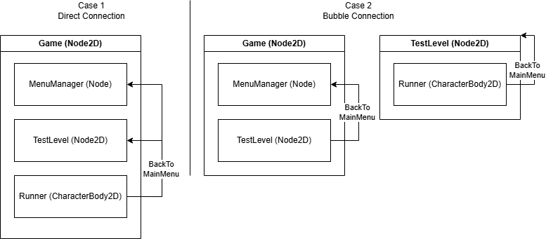

# Connector Pattern

Das Connector Pattern bietet eine in der UI sichtbare Möglichkeit, Signale aus verschachtelten Komponenten aufzufangen.

## Problem

In Godot kann mithilfe der UI ein _Signal_ an eine Funktion gebunden werden. Hierdurch wird im Editor sichtbar, dass es 
eine solche Verbindung gibt, und es ist kein manuelles Entfernen des _EventHandler_ notwendig.

Dieses System funktioniert allerdings nur, wenn die _Node_ mit dem _Signal_ in der aktuellen _Node_ sichtbar ist. 
Folgendes Diagram stellt die Problematik in zwei Fällen dar.



### Erklärung

- Fall 1
  - Dies ist das optimale Szenario. Die Nodes befinden sich alle auf einer Ebene
  - Wird ein Signal von _Runner_ versendet, können der _MenuManager_ und _TestLevel_ dieses direkt abonnieren
- Fall 2
  - In diesem Szenario ist die Struktur verschachtelt. _Runner_ ist ein Child von _TestLevel_
  - _MenuManager_ kann nicht direkt das Signal von _Runner_ abonnieren
  - Daher stellt _TestLevel_ auch ein entsprechendes Signal zur Verfügung. Das Signal wird also nach oben durchgereicht
  - Das Signal wandert wie eine Blase nach oben

Und hier entsteht großer Overhead und eine nicht durchschaubare Struktur. Sollte das _BackToMainMenu_-Signal mehrere
Schichten tief sein, müsste dieses durchgereicht werden, bis nach oben hin zum Empfänger. Nodes würden das Signal
veröffentlichen, obwohl sie nichts damit machen. Sie wären nur Mittelsmann.

### Gängige Lösung

Eine gängige Lösung ist es, einen Autoload zu verwenden. Diese Klasse wird automatisch von Godot geladen und dem
SceneTree hinzugefügt. Es verhält sich also wie ein Singleton. **Problem hier** ist allerdings die nicht vorhandene
Integration in der UI. Signale müssen manuell verbunden und auch wieder entfernt werden. Das findet nicht zentral
statt, sondern muss in jeder Klasse passieren, die ein Signal veröffentlichen möchte. Wird das Entfernen vergessen,
dann kann es zu Memory Leaks kommen.

## Lösung

Das Connector Pattern hat also zwei Aufgaben:
1. Eine intuitive Verknüpfung von Signalen über den Godot Editor
2. Fehleranfälligkeit reduzieren

Um diese Ziele zu erreichen, greift das Pattern auf die Node-Strukturen von Godot zurück, um Signale im Editor 
verknüpfbar zu machen, und arbeitet im Hintergrund mit einem _Service_, über den die Verknüpfungen stattfinden.

### Teil 1 - ConnectorService

Im ConnectorService werden alle Events definiert, welche veröffentlicht und abonniert werden können. Dabei handelt es
sich um statische Funktionen und Eigenschaften. Bedeutet, dass dieses Pattern nicht für separate Aktionen genutzt werden
kann – bspw. Spieler 1 öffnet im Splitscreen sein Inventar, Spieler 2 spielt aber weiter.

Neben der Definition und dem Aufrufen der Events beinhaltet diese Klasse nichts weiter. Es sollte im Sinne des
Single-Responsibility-Pattern keine weitere Logik in dieser Klasse ausgeführt werden.

```csharp
public sealed class GameEventsConnectorService
{
    public static event Action QuitGameEvent;

    public static void RaiseQuitGameEvent() => QuitGameEvent?.Invoke();
}
```

### Teil 2 - Flags

Mithilfe von Flags kann später im Editor genau gesteuert werden, welche Signale überhaupt versendet werden können. Im
Beispiel gerade haben wir einen _GameEventsConnectorService_ mit nur einem Event definiert. In der Realität wird dieser
Service allerdings weitaus mehr Events anbieten. Damit nicht alle später im Connector auch mit dem Service verbunden
werden müssen, können Flags genutzt werden.

```csharp
[Flags]
public enum GameEventFlags
{
    None = 0,
    QuitGame = 1 << 0
}
```

### Teil 3 - Connector

Der Connector selbst ist eine _Node_ in Godot. In ihm werden die Signale definiert, die dann im Editor mit Funktionen
verbunden werden können. Um zu wissen, wann die Signale ausgelöst werden müssen, werden diese mit den Events aus dem
ConnectorService verknüpft. Um Memory Leaks zu verhindern, werden diese Verknüpfungen beim Verlassen des Trees wieder
entfernt.

````csharp
public partial class GameEventsConnector : Node
{
    [Export] public GameEventFlags ConnectToEvents { get; set; }
    
    [Signal] public delegate void QuitGameEventHandler();

    public override void _Ready()
    {
        if (ConnectToEvents.HasFlag(GameEventFlags.QuitGame))
            GameEventsConnectorService.QuitGameEvent += EmitSignalQuitGame;
    }

    public override void _ExitTree()
    {
        if (ConnectToEvents.HasFlag(GameEventFlags.QuitGame))
            GameEventsConnectorService.QuitGameEvent -= EmitSignalQuitGame;
    }
}
````
### Teil 4 - Verwendung

1. Der Connector wird als Child einer beliebigen Node hinzugefügt
2. Im Editor wird angehakt, welche Events verknüpft werden sollen
3. Im Editor kann das Signal des Connectors mit einer Funktion verknüpft werden
4. Zum Auslösen eines Events kann von beliebiger Stelle einfach der ConnectorService aufgerufen werden
````csharp
GameEventsConnectorService.RaiseQuitGameEvent();
````
